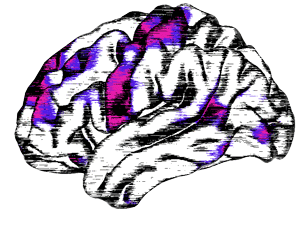

### Neuroimaging & Psychiatry Lab (Garza Lab)

We are a research group at the [National Institute of Psychiatry](http://www.inprf.gob.mx) in Mexico City, Mexico. Our research focuses on finding neuroimaging biomarkers of diagnosis and treatment in substance addiction and other neuropsychiatric disorders.

### [People](people.md) - [Publications](pub.md) - [Projects](proj.md) - [Contact](contact.md) - [Github](https://github.com/garzalab)
