[<- Back](index.md)

## People

### Lab Leader (PI)

 Eduardo A. Garza-Villarreal, M.D., Ph.D.

* *Assistant Professor, Institute of Neurobiology, UNAM, Mexico.*

* *Visiting Senior Researcher, University of Aarhus, Denmark.*

[Personal Website](https://egarza.github.io) - [Github](https://github.com/egarza) - [Twitter](https://twitter.com/egarzav) - [ResearchGate](https://www.researchgate.net/profile/Eduardo_Garza_Villarreal) - [Google Scholar](https://scholar.google.dk/citations?user=bX502bUAAAAJ&hl=en) - [OSF](https://osf.io/uc6aj/) - [ORCID](https://orcid.org/0000-0003-1381-8648) - [AU](http://pure.au.dk/portal/en/eduardoa@cfin.au.dk)

### External Collaborators

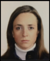 Ruth Alcala-Lozano, M.D., M.Sc.

* *Researcher in Medical Sciences, Clinical Research Division, National Institute of Psychiatry, Mexico.*

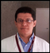 Jorge Gonzalez-Olvera, M.D., Ph.D.

* *Head of Department, Clinical Research Division, National Institute of Psychiatry, Mexico.*

 Ernesto Reyes-Zamorano, Ph.D.

* *Assistant Profesor, Faculty of Psychology, Anahuac University, Mexico.*

### PhD students

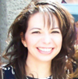 Thania Balducci, M.D., M.Sc.

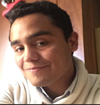 Said Jimenez, M.Sc.

### Master students

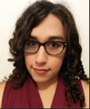 Sofia Fernandez, B.A.

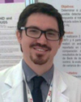 Alan Davalos, M.D.

### Bachelor Students

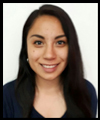 Alely Valencia

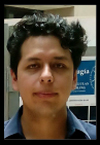 Alexis Ponce

### TMS team (students)

 Erik Morelos, M.Sc.

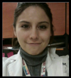 Alejandra Torres, B.A.

### External students

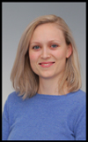 Sigrid Lunde, M.Sc.

*Ph.D. Student, Department of Psychology and Behavioural Sciences, University of Aarhus, Denmark.*

### Former students

 Diego Angeles-Valdez, B.A.

 Victor Pando, M.Sc.

 Viviana Villicaña, B.A.

 Josue Mendoza, B.A.

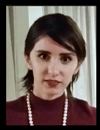 Pamela Palacios, M.Sc.

### Group Photos

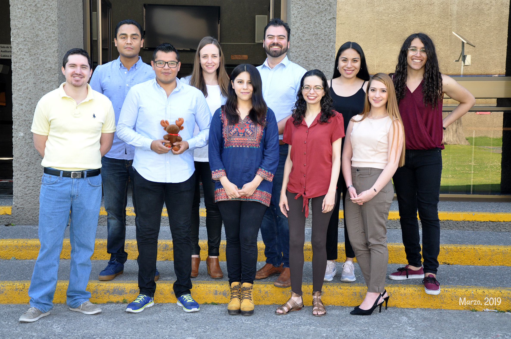

*The team at the National Institute Psychiatry. From left to right, bottom: Alan, Diego, Alejandra, Thania, Viviana; top: Said, Ruth, Eduardo, Alely, Sofia.*

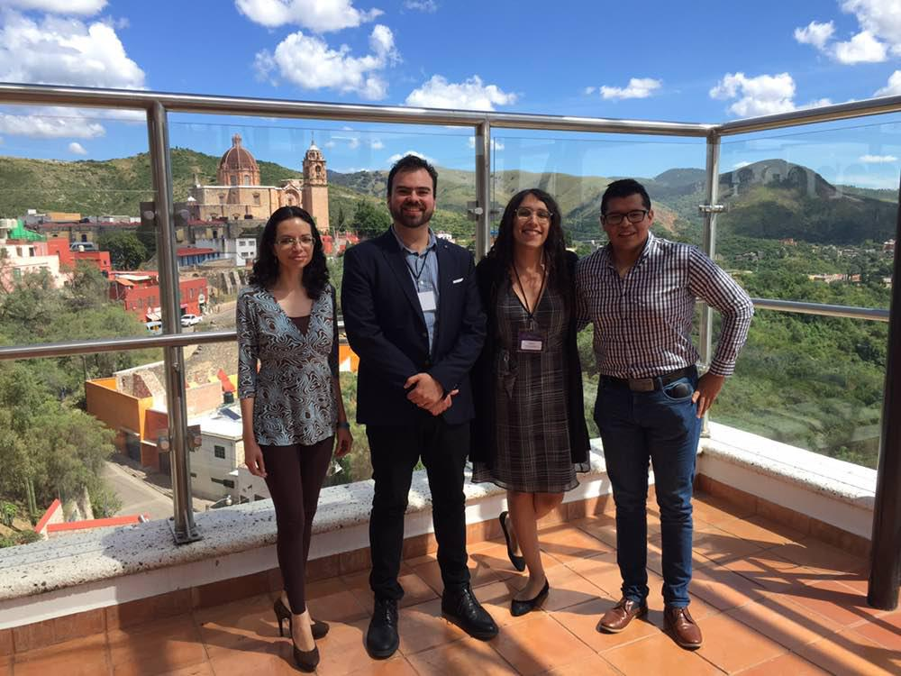

*At the CIMAT Neuroimaging Meeting 2018 in Guanajuato, Mexico.*

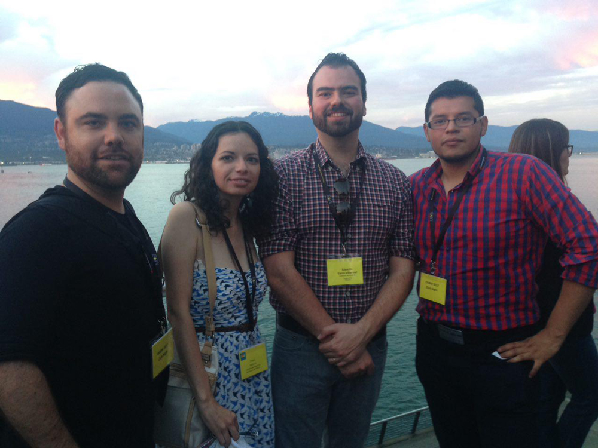

*At the OHBM Meeting 2016 in Vancouver, Canada.*