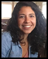
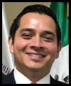

[<- Back](index.md)

## People

### Lab Leader (PI)

 Eduardo A. Garza-Villarreal, M.D., Ph.D.

* *Assistant Professor, Institute of Neurobiology, UNAM, Mexico.*

* *Visiting Senior Researcher, University of Aarhus, Denmark.*

[Personal Website](https://egarza.github.io) - [Github](https://github.com/egarza) - [Twitter](https://twitter.com/egarzav) - [ResearchGate](https://www.researchgate.net/profile/Eduardo_Garza_Villarreal) - [Google Scholar](https://scholar.google.com/citations?user=bX502bUAAAAJ&hl=en) - [OSF](https://osf.io/uc6aj/) - [ORCID](https://orcid.org/0000-0003-1381-8648) - [AU](http://pure.au.dk/portal/en/eduardoa@cfin.au.dk)

### PhD students

 Thania Balducci, M.D., M.Sc., Medical Sciences

### Master students

 Diego Angeles-Valdez, B.A., Neurobiology

 Sofia Fernandez, B.A., Neurobiology

 Alan Davalos, M.D., Medical Sciences

 Alejandra Lopez-Castro, M.D., Neurobiology

 Deyanira Muguía-Villanueva, M.D., Neurobiology

### Bachelor Students

 Alely Valencia, Psychology

 Alexis Ponce, Psychology

### External students (co-supervising)

 Luis A. Trujillo, M.Sc., Biochemistry

*Ph.D. Student, Faculty of Medicine, Universidad Autónoma de Nuevo León. Supervisor: Alberto Camacho*

 Said Jimenez, M.Sc., Psychology

*Ph.D. Student, Faculty of Psychology, UNAM. Supervisor: Juan José Sanchez Sosa*

 Victor Pando, M.Sc.

*Ph.D. Student, Center for Music in the Brain, University of Aarhus, Denmark. Supervisor: Peter Vuust*

 Sigrid Lunde, M.Sc.

*Ph.D. Student, Department of Psychology and Behavioural Sciences, University of Aarhus, Denmark. Supervisor: Lene Vase.*

### Alumni

 Viviana Villicaña, B.A.

 Josue Mendoza, B.A.

 Pamela Palacios, M.Sc.

### Group Photos

*The team at the National Institute Psychiatry. From left to right, bottom: Alan, Diego, Alejandra, Thania, Viviana; top: Said, Ruth, Eduardo, Alely, Sofia.*

*At the CIMAT Neuroimaging Meeting 2018 in Guanajuato, Mexico.*

*At the OHBM Meeting 2016 in Vancouver, Canada.*